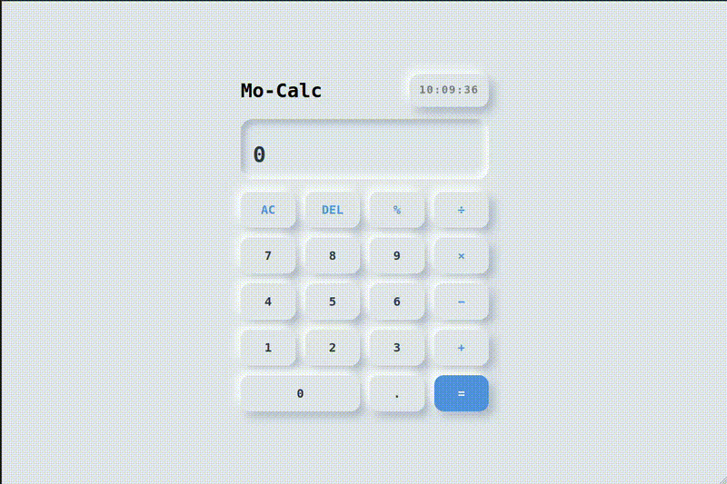

# Mo-Calc — Calculatrice Web Neumorphique

**Mo-Calc** est une calculatrice web moderne développée avec **HTML5, Sass/SCSS et JavaScript Vanilla**.

Le projet met l'accent sur une interface **neumorphique**, une expérience utilisateur fluide, le **responsive design**, l'accessibilité et une gestion sécurisée des calculs sans utiliser `eval()`.

---

## Démo

<p align="center">

</p>

---

## Fonctionnalités

- Calculs de base :
  - Addition `+`
  - Soustraction `−`
  - Multiplication `×`
  - Division `÷`

- Gestion des décimales
- Pourcentage `%`
- Suppression du dernier caractère `DEL`
- Réinitialisation complète `AC`
- Gestion de la division par zéro
- Gestion des nombres invalides
- Support du clavier
- Horloge numérique animée
- Affichage de l'expression et du résultat
- Formatage des grands nombres
- Interface responsive
- Design mobile-first
- Effets neumorphiques
- États `hover`, `active` et `focus-visible`
- Attributs ARIA pour l'accessibilité

---

## Sécurité et bonnes pratiques

Le projet évite volontairement l'utilisation de :

```js
eval();
```

Les opérations sont traitées avec une logique contrôlée en JavaScript à l'aide d'opérateurs explicitement autorisés.

Le projet utilise également :

- `textContent` pour mettre à jour le DOM
- `Number()` pour convertir les valeurs numériques
- `Number.isFinite()` pour valider les nombres
- Une gestion explicite de la division par zéro
- `type="button"` sur les boutons
- `aria-live` pour annoncer les changements du résultat
- `focus-visible` pour améliorer l'accessibilité au clavier

Cette approche limite notamment les risques liés à l'exécution dynamique de code provenant de l'entrée utilisateur.

---

## Technologies utilisées

| Technologie        | Utilisation                    |
| ------------------ | ------------------------------ |
| HTML5              | Structure et accessibilité     |
| Sass / SCSS        | Architecture et styles         |
| JavaScript Vanilla | Logique de la calculatrice     |
| Vite               | Environnement de développement |
| pnpm               | Gestionnaire de paquets        |
| Git                | Gestion de versions            |
| GitHub             | Hébergement du projet          |

---

## Responsive Design

Mo-Calc est développé avec une approche **Mobile First**.

L'interface s'adapte notamment aux :

- smartphones
- tablettes
- ordinateurs portables
- écrans desktop

La mise en page utilise principalement **CSS Grid**, **Flexbox** et les **media queries**.

---

## Installation

### 1. Cloner le projet

```bash
git clone https://github.com/MoDev228/neumorphic-calculator.git
```

### 2. Accéder au projet

```bash
cd neumorphic-calculator
```

### 3. Installer les dépendances

```bash
pnpm install
```

### 4. Lancer le serveur de développement

```bash
pnpm dev
```

Vite affichera ensuite l'adresse locale du projet dans le terminal.

---

## Build de production

Pour générer la version de production :

```bash
pnpm build
```

Pour tester la version générée :

```bash
pnpm preview
```

---

## Objectifs du projet

Ce projet a été réalisé pour mettre en pratique plusieurs concepts importants du développement frontend :

- Structuration sémantique avec HTML5
- Architecture SCSS modulaire
- Variables et mixins Sass
- CSS Grid et Flexbox
- Responsive Design
- JavaScript DOM
- Gestion des événements
- Event delegation
- Manipulation des `data-*`
- Validation des données
- Gestion des erreurs
- Accessibilité
- Sécurité côté frontend
- Utilisation de Vite
- Workflow Git/GitHub

---

## Améliorations possibles

Quelques fonctionnalités pourront être ajoutées ultérieurement :

- Historique des calculs
- Mode sombre
- Raccourcis clavier supplémentaires
- Calculs scientifiques
- Mémoire `M+`, `M-`, `MR`, `MC`
- Meilleure gestion des nombres très grands avec une précision arbitraire
- Tests automatisés JavaScript
- PWA

---

## Auteur

**Mohamed Boukari — MoDev228**

Développeur en formation spécialisé dans le développement d'applications.

- GitHub : [MoDev228](https://github.com/MoDev228)
- Portfolio : [modev-portfolio-six.vercel.app](https://modev-portfolio-six.vercel.app/)

---

## Licence

Ce projet est réalisé à des fins d'apprentissage et de portfolio.
